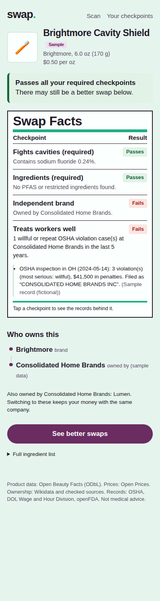
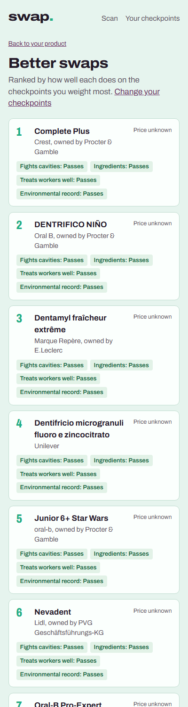
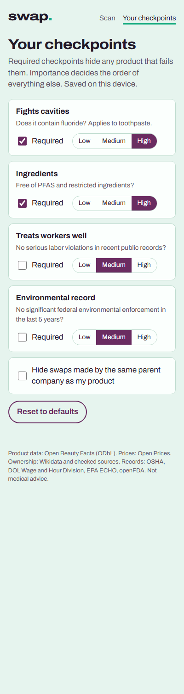

# Swap

**Scan a toothpaste. See whether it does what it promises, what's in it, and what the public
record says about the company that makes it, then find alternatives that do better on what you
care about.**

The name on the label often isn't the company behind it: Tom's of Maine and hello both belong to
Colgate-Palmolive. Swap traces a brand to its parent company, checks that company against
government enforcement records, and ranks alternatives by your own priorities. It judges
companies on what the records show they've done, not on their size or who owns them. Every
verdict links to the record behind it, and missing data shows as "unknown", never as a pass.

| Scan result | Better swaps | Your checkpoints |
|---|---|---|
|  |  |  |

*Real data: Crest 3D White from Open Beauty Facts. Its label scan is incomplete, so fluoride
shows as unknown rather than a fail; the worker check uses Procter & Gamble's Wage and Hour
records.*

## Checkpoints

| Checkpoint | Question | Evidence |
|---|---|---|
| Fights cavities | Does it contain fluoride? (toothpaste only) | Ingredient list, Open Beauty Facts |
| Ingredients | Free of PFAS and restricted ingredients? | Ingredient list + rule files in `swap/rules/` |
| Treats workers well | No serious labor violations in the last 5 years? | OSHA inspections, DOL Wage and Hour cases, via the parent company |
| Environmental record | No significant federal environmental enforcement in the last 5 years? | EPA federal enforcement cases (ICIS FE&C), via the parent company |

Plus a **recall warning** from openFDA enforcement reports and **price per ounce** from Open Prices.
Each product also shows **who owns it** (Wikidata ownership graph + checked overrides), as
information: ownership is how a brand is linked to its parent company's records, not a verdict.

You mark checkpoints as *required* (a failure hides the product) and set each one's
*importance* (which orders what's left). If you'd rather move your money away from a company,
you can also hide alternatives made by the same parent company as your product.

## How it works

```
barcode ─► products table ──miss──► Open Beauty Facts API (saved after first scan)
              │
              ├─► ownership graph: brand ─► parent ─► parent's parent   (cycle-safe walk)
              │        └─ overrides CSV, then Wikidata (owned by / parent organization)
              │
              ├─► aliases: messy government names ─► org   (normalize + conservative match)
              │        └─ labor_cases (OSHA, WHD)   env_cases (EPA)   recalls (openFDA)
              │
              └─► checkpoints ─► gate by required ─► rank by weighted score
```

- **Data is loaded ahead of time, not scraped per scan.** Bulk records (OSHA, WHD, EPA,
  recalls, ownership) are loaded by CLI jobs. Product lookups and prices are fetched live once, then cached.
  After the first scan of a product, everything runs against the local database.
- **Name matching is conservative.** "COLGATE PALMOLIVE COMPANY INC" and "Colgate-Palmolive Co."
  normalize to the same key. Fuzzy matches need the same first token, 3 of 4 tokens shared, and
  no close runner-up. A wrong match would pin someone else's violations on a company, so
  uncertain names stay unmatched.
- **"No records" only counts when the dataset is loaded.** The `datasets` table records what's
  loaded. Without OSHA/WHD data, the worker checkpoint says "unknown", not "pass".
- **Outside failures never break a scan.** Every external call has a timeout and retries, and a
  failure degrades that one field to "unknown".
- **Thresholds are config, not code.** Lookback windows, the back-wages limit and the EPA
  penalty limit live in `swap/config.py`, and every result shows the underlying cases so a user
  can disagree.

## Run it

```bash
python -m venv .venv && source .venv/bin/activate
pip install -e ".[dev]"
swap serve            # http://localhost:8000
```

An empty database is seeded with **fictional sample products** (barcodes starting with `2`, a
GS1 prefix reserved for in-store use, so they can't collide with real products), so every kind of
result is visible immediately. Scanning or typing a real barcode looks it up live.

Camera scanning needs HTTPS (or `localhost`). It uses the browser's `BarcodeDetector` where
available and falls back to ZXing elsewhere, including iOS Safari.

## Load real data

```bash
swap load-products --pages 10      # toothpastes from Open Beauty Facts
swap load-ownership                # resolve brand owners on Wikidata
swap load-recalls                  # openFDA drug enforcement reports for tracked companies

# Wage and Hour: https://data.dol.gov/datasets/10362 -> "Download Complete Dataset"
# (WHD_enforcement.zip, ~200 MB, a set of CSV chunks). Unzip into raw/whd/, then:
swap check-columns whd raw/whd/<any chunk>.csv
swap load-whd raw/whd/*.csv        # load every chunk in one run

swap check-columns osha-inspection raw/osha_inspection.csv
swap load-osha raw/osha_inspection.csv raw/osha_violation.csv

# EPA federal enforcement: https://echo.epa.gov/tools/data-downloads -> "ICIS FE&C Dataset"
# (case_downloads.zip, ~80 MB). Unzip into raw/epa/, then:
swap check-columns epa-defendants raw/epa/CASE_DEFENDANTS.csv   # also epa-cases, -penalties, -conclusions
swap load-epa raw/epa
```

**Environmental record.** EPA's case data spreads one case over several files; the loader joins
defendants, cases, conclusions and penalties by case number. A company fails with **$100,000 or
more in federal penalties in the last 5 years** (configurable). Only concluded cases count (a
pending case isn't a finding), and **Superfund (CERCLA) cases are excluded**: liability there
doesn't depend on wrongdoing, and one case can name hundreds of companies that once sent waste to
a site. Penalties come from `CASE_PENALTIES.csv`, because the case file's own penalty column is
blank on recent cases. This measures compliance with US federal environmental law, not climate
impact, and only federal cases: most routine enforcement is done by states.

The DOL loaders stream large files and keep only rows matching a tracked company, so the
database stays small. If DOL renames a column, `check-columns` says which, and the mapping lives
in one place (`swap/sources/dol.py`). Column names are compared case-insensitively, since DOL's
field docs are lowercase but the WHD download is uppercase. `load-whd` takes all chunks at once so
the dataset is only marked loaded when it's complete; otherwise a partial load could report "no
cases" for a company whose cases are in a chunk that wasn't loaded.

Government records are matched only against **companies**, never brands: they name employers
and recalling firms, and brand names are often ordinary words ("C.R.E.S.T., Inc" is a care
provider, not Crest). A brand still sees its parent company's records. Likewise, a brand name
that matches more than one Wikidata item (e.g. "Signal" is also a record label) is skipped
rather than guessed, since the wrong owner would bring the wrong company's records with it.

**Follow-up: OSHA.** The OSHA loader is tested against recorded fixtures but hasn't been run on
the real downloads yet (several GB). Until it is, the worker checkpoint uses WHD only and says so.

Set `SWAP_SEED_DEMO=0` to start without sample data, and `SWAP_LIVE_LOOKUPS=0` to run fully
offline.

## Deploy

The app is one container with SQLite on a volume.

```bash
docker build -t swap . && docker run -p 8000:8000 -v swap-data:/data swap
```

On Render or Railway: create a web service from this repo using the Dockerfile and attach a disk
at `/data`. Without a disk the app still works but reseeds sample data on each restart.

## Tests

```bash
pytest -q && ruff check .
```

Tests run offline against recorded fixtures of each outside API, covering name matching,
ingredient rules (fluoride is never flagged as PFAS), multi-level ownership with cycles, OSHA
severity and deleted citations, the "dataset not loaded" rule, gating, ranking and the HTTP API.
Fixtures ending in `_real` are recorded from the live services and cover quirks found there:
HTML-escaped text from Open Beauty Facts, ambiguous Wikidata labels, openFDA rejecting non-ASCII
searches, the WHD download's uppercase headers, timestamp dates and chunked files, and EPA case
files with space-padded values and penalties stored outside the case file.

## Limits

- Toothpaste only for now. Adding a category means a category tag in
  `sources/openbeautyfacts.py` and deciding which checkpoints apply.
- Labor and EPA records are US-only. A company with little US presence (e.g. a French retailer)
  passes "no cases found" because US records couldn't contain it; the result says "US records
  only". Judging only companies with a known US presence would be more precise.
- The environmental record uses federal EPA cases only. State enforcement and climate data
  (e.g. EPA greenhouse gas reporting) aren't included yet.
- Wikidata ownership is volunteer-edited. Checked facts in `rules/ownership_overrides.csv` take
  priority, and each link shows its source.
- Open Beauty Facts coverage is uneven. Missing products get a clear "we don't have this yet".
- Planned: supply-chain forced labor from official lists (UFLPA Entity List, CBP Withhold
  Release Orders). Allegations without an official record won't produce a verdict.

## Data sources and licenses

Open Beauty Facts and Open Prices (ODbL), Wikidata (CC0), OSHA and DOL Wage and Hour Division
enforcement data, EPA ECHO enforcement data, openFDA. Swap is not medical advice.
